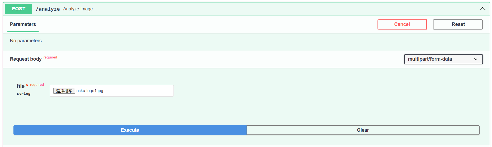
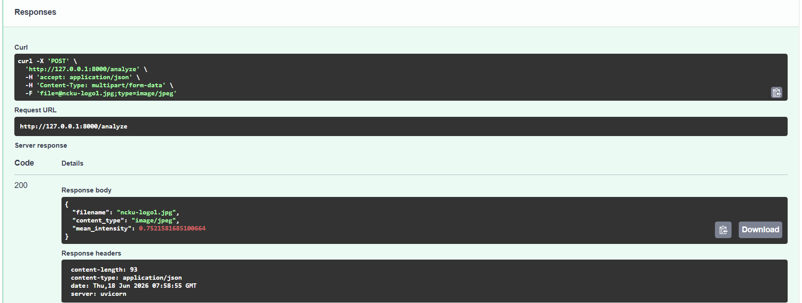

# FastAPI 後端 MVP：圖片上傳與初步影像分析(底下請GPT幫我講解今天更新的內容)




這次更新中，我們完成了 iGEM 軟體後端的第一個最小可行版本，也就是 MVP。

這個階段的主要目標是確認一件事：

> 使用者是否可以上傳圖片，後端是否可以成功接收圖片，並使用 Python 進行初步影像分析。

這是未來建立螢光影像分析工具的重要基礎。

---

## 本次完成的內容

目前我們建立了一個 FastAPI 後端，並完成了幾個基本 API：

| API             | 功能              |
| --------------- | --------------- |
| `GET /`         | 確認後端是否有正常回應     |
| `GET /health`   | 檢查伺服器狀態         |
| `GET /project`  | 回傳專案基本資訊        |
| `POST /upload`  | 上傳圖片並回傳圖片基本資訊   |
| `POST /analyze` | 上傳圖片並回傳初步影像分析結果 |

其中最重要的是：

```text
POST /upload
POST /analyze
```

這兩個 API 代表後端已經可以接收圖片，並開始進行影像分析。

---

## 圖片上傳功能

我們首先建立了 `/upload` API，讓使用者可以上傳圖片到後端。

當圖片成功上傳後，後端會回傳圖片的基本資訊，例如：

```json
{
  "filename": "ncku-logo1.jpg",
  "content_type": "image/jpeg",
  "size": 76667
}
```

這代表後端已經可以成功取得：

```text
圖片檔名
圖片格式
圖片大小
```

這一步非常重要，因為未來 wet lab 的螢光影像也會透過類似方式傳到後端進行分析。

---

## 使用 scikit-image 進行初步影像分析

在確認圖片上傳成功後，我們進一步建立了 `/analyze` API。

這個 API 會接收使用者上傳的圖片，並使用 `scikit-image` 讀取圖片，再用 `NumPy` 計算圖片的平均亮度。

目前的分析流程如下：

```text
使用者上傳圖片
→ FastAPI 接收圖片
→ scikit-image 讀取圖片
→ 將圖片轉成灰階
→ NumPy 計算平均亮度
→ FastAPI 回傳分析結果
```

測試結果如下：

```json
{
  "filename": "ncku-logo1.jpg",
  "content_type": "image/jpeg",
  "mean_intensity": 0.7521581685100664
}
```

其中 `mean_intensity` 代表圖片的平均亮度。

在目前的版本中，亮度數值通常介於：

```text
0 到 1
```

其中：

```text
0 代表較暗
1 代表較亮
```

因此這次測試圖片的平均亮度約為 `0.75`，代表整體亮度偏高。

---

## 為什麼使用 FastAPI？

FastAPI 在這個專案中扮演後端 API 的角色。

它主要負責：

```text
接收前端送來的圖片
處理 API 請求
把圖片交給 Python 影像分析程式
將分析結果回傳給前端
```

也就是說，FastAPI 不是負責做網頁外觀，而是負責讓前端和後端分析程式能夠溝通。

未來完整流程會像這樣：

```text
前端網頁
→ 使用者上傳圖片
→ FastAPI 後端接收圖片
→ Python 影像分析
→ 回傳數值結果
→ 前端顯示分析結果
```

---

## 為什麼使用 scikit-image？

這次我們選擇使用 `scikit-image` 作為影像分析工具。

原因是 `scikit-image` 比較適合科學影像分析，未來可以延伸到更多與螢光影像相關的功能，例如：

```text
背景扣除
閾值分割
螢光區域偵測
螢光強度計算
螢光區域面積計算
```

目前的平均亮度分析只是第一步，目的是先確認後端分析流程可行。

---

## 目前成果的意義

這次更新的重點不是完成最終版的螢光分析工具，而是先完成最核心的技術驗證。

目前我們已經證明：

```text
圖片可以被上傳到後端
FastAPI 可以成功接收圖片
scikit-image 可以讀取圖片
後端可以計算影像數值
分析結果可以用 JSON 格式回傳
```

這代表我們已經完成從「圖片輸入」到「數值輸出」的基礎流程。

---

## 下一步規劃

接下來會繼續擴充這個後端 MVP，主要方向包括：

1. 將 API 程式和影像分析程式分開整理。
2. 新增更適合螢光影像的分析方法。
3. 加入背景扣除功能。
4. 偵測螢光區域。
5. 計算螢光區域面積、最大亮度、平均亮度與總強度。
6. 建立簡單前端介面，讓使用者可以上傳圖片並看到分析結果。

---

## 總結

這次更新完成了 iGEM 軟體後端的第一個 MVP。

目前後端已經可以：

```text
接收圖片
讀取圖片
分析圖片平均亮度
回傳分析結果
```

這為後續的螢光影像分析工具建立了基礎。接下來，我們會在這個架構上逐步加入更完整的 wet lab 影像分析功能。
