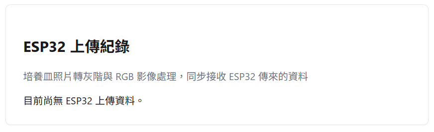

# ESP32 資料接收與前端顯示整合

本篇記錄 ESP32 與軟體系統整合的第一階段成果：**接收 ESP32 傳來的文字與照片，並在前端顯示**。影像處理（灰階轉換、RGB 分析）尚未串接，會在下一階段實作。


<!-- more -->

## 目標

組長希望軟體端能結合 ESP32，讓 ESP32 讀取的資料（文字狀態 + 培養皿照片）可以即時同步到系統上，之後再接上影像分析模組。這個階段的範圍刻意縮小為：

- ESP32 → 後端：接收文字與照片
- 後端 → 前端：讓資料在網頁上看得到

不包含影像處理邏輯，先確保資料流打通。

## 技術棧

| 部分 | 技術 |
|---|---|
| 後端 | FastAPI |
| 後端部署 | Render |
| 前端 | 靜態網站（HTML/CSS/JS） |
| 前端部署 | GitHub Pages（GitHub Actions 自動部署） |
| ESP32 韌體 | Arduino / ESP32-CAM |

## 架構設計：依主題分資料夾

因為軟體會分成多個小主題（ESP32、之後的影像處理等），後端採用「每個主題完全獨立」的模組化結構，各主題有自己的 `config.py`、`storage.py`、router，彼此不共用、不互相干擾：

```
backend/
├── main.py                     # 只負責整合各主題的 router，不寫商業邏輯
├── requirements.txt
└── esp32/
    ├── __init__.py
    ├── config.py                # 路徑設定（上傳資料夾、資料檔位置）
    ├── storage.py                # 讀寫 data.json
    ├── upload.py                 # API router：/esp32/upload、/esp32/records、/esp32/uploads/{filename}
    └── upload_esp32cam.ino       # ESP32-CAM 韌體範例
```

之後新增主題（例如 `image_processing/`）時，複製同樣的模式即可：自己的 `config.py` + `storage.py` + router（換一個 URL prefix），再到 `main.py` 加兩行 import / include_router，不會動到既有功能。

## 後端 API

| Method | 路徑 | 說明 |
|---|---|---|
| `POST` | `/esp32/upload` | 接收 `text`（表單文字欄位）與 `image`（照片檔案），存檔並記錄 |
| `GET` | `/esp32/records` | 取得所有上傳紀錄（依時間新到舊排序） |
| `GET` | `/esp32/uploads/{filename}` | 讀取單張已上傳的照片 |
| `GET` | `/health` | 既有功能，檢查後端存活 |
| `POST` | `/api/analyze` | 既有功能，文字/圖片分析（維持不動） |

`/esp32/upload` 收到資料後會存成一筆紀錄：

```json
{
  "id": "uuid",
  "text": "培養皿狀態正常",
  "image": "檔名.jpg",
  "timestamp": "2026-07-16 10:30:00"
}
```

## 前端顯示

在既有的 `index.html`（分析表單頁面）下方新增一個區塊，獨立於原本的分析功能：

```html
<section class="card">
  <h2>ESP32 上傳紀錄</h2>
  <div id="esp32-records"></div>
</section>
```

`script.js` 每 5 秒 poll 一次 `/esp32/records`，把最新資料渲染成卡片，包含時間戳記、文字內容、照片縮圖。

## 部署方式

前端與後端各自獨立部署，兩邊都要 push 到 GitHub 才會分別觸發自動部署：

```bash
git add .
git commit -m "說明這次改了什麼"
git push origin main
```

- 前端：GitHub Actions（`deploy-pages.yml`）自動建置並發布到 GitHub Pages
- 後端：Render 偵測到新的 commit 後自動重新 build 並部署（`Auto-Deploy` 設為 `Yes`）

驗證更新是否成功：

- 後端存活：`GET https://<服務名稱>.onrender.com/health` 應回傳 `{"status": "ok"}`
- 前端更新：打開 GitHub Pages 網址，確認「ESP32 上傳紀錄」區塊有出現

## 目前已知限制

!!! warning "資料是暫時性的"
    Render 免費方案的磁碟是暫存空間，服務重新部署或閒置後重新喚醒，`esp32/uploads/` 內的照片與 `data.json` 的紀錄都會被清空。這是目前刻意選擇的做法（先求資料流跑通），**不是 bug**。之後若要長期保存資料，會改成：

    - 照片 → Cloudinary / AWS S3 等雲端物件儲存
    - 紀錄 → Render 提供的 PostgreSQL，或串接 Google Sheets

!!! warning "免費方案會休眠"
    閒置約 15 分鐘後服務會休眠，下一個請求會有 cold start（可能 30 秒以上）。韌體端的 HTTP timeout 已設為 30 秒因應。

---

## 下一步：如何跟硬體配合

目前軟體端已經準備好「接收端」，接下來要跟硬體組對接的是**實際的 ESP32 裝置**，需要確認以下事項：

### 1. 確認硬體規格與連線方式

- [ ] 使用的 ESP32 型號（是否為 ESP32-CAM，或另外接攝影機模組）
- [ ] 供電方式：USB 供電 or 電池，會不會影響長時間運作測試
- [ ] Wi-Fi 連線環境：實驗室網路的 SSID/密碼、訊號穩定度
- [ ] 拍照頻率與觸發方式：定時拍照，還是由感測器事件觸發

### 2. 對接資料格式

- [ ] 確認韌體上傳時 `text` 欄位要放什麼內容（純狀態文字？感測器數值？時間戳記由硬體端還是後端產生？）
- [ ] 確認照片格式（JPEG）與解析度，避免檔案過大導致上傳逾時
- [ ] 跟硬體組對齊 `serverUrl` 是否已更新成正式後端網址：`https://<服務名稱>.onrender.com/esp32/upload`

### 3. 測試計畫

| 測試項目 | 目的 | 驗收標準 |
|---|---|---|
| 單次上傳測試 | 確認 ESP32 能成功打到 `/esp32/upload` | 後端回傳 `{"status": "ok"}`，前端畫面出現該筆紀錄 |
| 連續上傳測試 | 模擬長時間運作，確認穩定度 | 連續 N 小時定時上傳，紀錄不遺漏、無重複 |
| 冷啟動測試 | Render 休眠後 ESP32 第一次上傳是否會失敗 | 確認 timeout 設定足夠，休眠後仍能成功上傳 |
| 弱網路測試 | 模擬實驗室 Wi-Fi 訊號不穩 | 上傳失敗時韌體是否有重試機制，不會卡死 |
| 照片品質測試 | 確認拍攝的培養皿照片解析度、對焦是否足以支援後續影像分析 | 影像清晰、無過曝/過暗，符合灰階轉換與 RGB 分析的輸入需求 |
| 資料一致性測試 | 確認多筆資料的時間戳記、文字內容對應正確 | 前端顯示順序與實際拍攝順序一致 |

### 4. 之後要銜接的功能

- 影像處理模組（灰階轉換、RGB 影像處理）將獨立成 `backend/image_processing/` 主題資料夾，讀取 `esp32/uploads/` 內已上傳的照片進行處理，不會更動 ESP32 主題本身的程式碼。
- 待影像處理模組完成後，前端會新增分析結果顯示區塊，與目前的「ESP32 上傳紀錄」區塊並列。

## 待辦事項總結

- [x] 後端 ESP32 主題模組（config / storage / upload router）
- [x] `main.py` 整合 esp32 router，不影響既有功能
- [x] ESP32 韌體範例（拍照 + multipart 上傳）
- [x] 前端顯示區塊與 JS 串接
- [ ] 與硬體組確認實際裝置規格與連線環境
- [ ] 執行上述測試計畫，記錄結果
- [ ] 開始 `image_processing/` 主題開發
